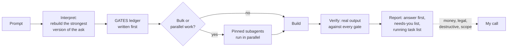

# AI, simply

**How I run AI inside a business. The rules my agents work under, the playbooks I use,
and the open-source skills I install. One repo, so none of it lives in my head.**

I'm Daniel Iozzi. Head of AI & Operations at an Australian subscription education
business, and before that four years in customer strategy at Deloitte Digital. I direct
AI coding agents to ship production systems, then get the team to use them. This is the
setup that does it. [Website](https://daniel-iozzi.vercel.app) ·
[LinkedIn](https://www.linkedin.com/in/daniel-iozzi-7a8a8516a/)

Nothing here is a framework. It is what I actually run, written down, with credit to
the people whose work I build on.

## What's in the repo

| Folder | What it is | Who wrote it |
|---|---|---|
| [`operating-system/`](operating-system/) | The rules file my agents read every session, the model routing, the delegation safety rule, five pinned agents | Me |
| [`playbooks/`](playbooks/) | Six short method notes. Gates and evidence, rollout register, structural guards, secrets, parallel sessions, writing a skill | Me |
| [`characters/`](characters/) | Four ready-made rules files. The Assistant, The Short Version, The Professor, The Operator. Pick one, one paste installs it | Me |
| [`skills/`](skills/) | Five open-source skills I recommend to anyone starting out, copied unchanged with their licenses | Their authors, see [CREDITS.md](CREDITS.md) |
| [`SETUP.md`](SETUP.md) | The one-paste installer for those five skills | Me |

## Start here (30 seconds)

**Five skills worth installing first.** Paste this into a new Claude Code session:

```
Fetch https://raw.githubusercontent.com/Coding-downunder/ai-simply/main/SETUP.md and follow it.
```

Only want one? Add it to the end, for example `Install humanizer only.`

| Skill | What it does | Author |
|---|---|---|
| handoff | Packs a long chat into a note a fresh chat can pick up | [Matt Pocock](https://github.com/mattpocock/skills) |
| grill-me | Grills you on a plan before anything gets built | [Matt Pocock](https://github.com/mattpocock/skills) |
| humanizer | Rewrites text that sounds like AI wrote it | [Siqi Chen](https://github.com/blader/humanizer) |
| unlazy | Writes its checks first, proves each one before "done" | [Leon Lin](https://github.com/Leonxlnx/unlazy) |
| teach | A tutor that remembers where you're up to | [Matt Pocock](https://github.com/mattpocock/skills) |

**Want a rules file?** Four characters, one paste each, in [`characters/`](characters/):

```
Fetch https://raw.githubusercontent.com/Coding-downunder/ai-simply/main/characters/SETUP.md and follow it. Default: The Short Version.
```

The full file my own agents run under is at
[`operating-system/CLAUDE.md`](operating-system/CLAUDE.md). Read it first and cut what
isn't you. It is written for one person's way of working, and that person is me.

Before installing any skill, from here or anywhere, read it. A skill is instructions
your agent follows with every permission you have given it.

## Why this exists

Four things kept going wrong when I put AI to work inside a real business. Each file
in this repo is the fix for one of them.

### 1. The agent did the wrong thing, confidently

**Problem.** Every chat started from zero. I repeated the same instructions, and it
still made calls I wanted to make myself, or asked permission for things I had already
directed.

**Fix.** One rules file, read at the start of every session:
[`operating-system/CLAUDE.md`](operating-system/CLAUDE.md). It sets how the agent
talks to me, and has exactly one list of what needs my decision: money, legal,
anything destructive, business scope. Everything else it decides and moves. A defect
is never a decision. If it broke something, it fixes it, then tells me.

Before a big build, [grill-me](skills/grill-me/) makes the agent interview me about
the plan until there are no holes left.

### 2. "Done" that wasn't done

**Problem.** The agent said the parser handled every case. It handled the cases it
had seen.

**Fix.** [Gates and evidence](playbooks/gates-and-evidence.md). Every task with two
or more steps opens with a ledger: one observable outcome per gate, the command that
checks it, the exact output that proves it. Done means real output pasted against
every gate. I enforce it with [unlazy](https://github.com/Leonxlnx/unlazy), which
blocks the "done" message until the evidence is there.

### 3. An agent briefed "read-only" made a live write

**Problem.** A research agent, told it was read-only, spawned a follow-up agent to
finish the job. The follow-up had never seen the brief. It made a real change in a
live payroll system.

**Fix.** Two files. [Delegation write-safety](operating-system/rules/delegation-write-safety.md):
name the forbidden endpoints, forbid onward delegation, give the agent somewhere safe
to stop, and write the brief for the least capable model that might read it.
[Structural guards](playbooks/structural-guards.md): wherever possible, a credential
that physically cannot write, proven by a script that tries to and must be refused.

### 4. Tools rolled out. Nobody used them

**Problem.** AI tools spread across the team with no way to see what was being used.
"Rolled out" got ticked and that was the end of it.

**Fix.** A [rollout register](playbooks/rollout-register.md) where the finish line is
a status called Adopted, with a written escalation cadence so nothing sits in Triage
or Rolled out forever. Plus [model routing](operating-system/rules/model-picking.md)
so the right model does each job, and a rule that whoever wrote it never reviews it.

## How a session runs



The top model plans, judges and reviews. Subagents do the mechanical work. Anything
irreversible waits for a person.

## Reference

### Operating system (mine)

- **[CLAUDE.md](operating-system/CLAUDE.md)**: the contract. Talk, decide, work, write, safety, model routing, credentials
- **[model-picking.md](operating-system/rules/model-picking.md)**: score models on cost, intelligence and taste. Cheap models gather, smart models ship. Whoever wrote it never reviews it
- **[delegation-write-safety.md](operating-system/rules/delegation-write-safety.md)**: a prohibition must travel down the delegation tree in words, every time
- **[agents/](operating-system/agents/)**: five pinned subagents, each a model and an effort level, so a worker never inherits the wrong setting

### Playbooks (mine)

- **[gates-and-evidence.md](playbooks/gates-and-evidence.md)**: what "done" means, and the ledger format
- **[rollout-register.md](playbooks/rollout-register.md)**: eight statuses, Adopted is the finish line, two intake streams that fail differently
- **[structural-guards.md](playbooks/structural-guards.md)**: a guard the agent cannot reason past beats a rule it can
- **[secrets-for-agents.md](playbooks/secrets-for-agents.md)**: the credential value never reaches the transcript
- **[parallel-agent-sessions.md](playbooks/parallel-agent-sessions.md)**: four sessions on one codebase, and the migration rule that failed
- **[writing-a-skill-that-fires.md](playbooks/writing-a-skill-that-fires.md)**: the description is the trigger, so it gets the scrutiny

### Skills I use (other people's, open source)

These are the libraries I install from, with what I use each for. Install from the
original repos, that is where the latest versions live.

| Library | Author | License | What I use it for |
|---|---|---|---|
| [mattpocock/skills](https://github.com/mattpocock/skills) | Matt Pocock | MIT | handoff, grill-me, teach, tdd, code-review, diagnosing-bugs, research. The spine of my engineering workflow |
| [Leonxlnx/unlazy](https://github.com/Leonxlnx/unlazy) | Leon Lin | MIT | Enforces the gates ledger with a Stop hook |
| [blader/humanizer](https://github.com/blader/humanizer) | Siqi Chen | MIT | Every piece of copy runs through it before it ships |
| [anthropics/skills](https://github.com/anthropics/skills) | Anthropic | Per skill | frontend-design, webapp-testing, the document skills |
| [emilkowalski/skills](https://github.com/emilkowalski/skills) | Emil Kowalski | MIT | UI polish, animation and the details that make software feel right |
| [pbakaus/impeccable](https://github.com/pbakaus/impeccable) | Paul Bakaus | Apache-2.0 | Design critique and iteration on anything with a screen |
| [nextlevelbuilder/ui-ux-pro-max-skill](https://github.com/nextlevelbuilder/ui-ux-pro-max-skill) | nextlevelbuilder | MIT | Picking a palette, type pairing and layout before a page is built |
| [vercel-labs/skills](https://github.com/vercel-labs/skills) | Vercel | MIT | The `npx skills add owner/repo` installer that pulls any of the above |

One command installs a whole library into any agent:

```
npx skills@latest add mattpocock/skills
```

### Skills in this repo

Five of the above, copied unchanged for the one-paste setup so someone new doesn't
need to know what `npx` is. Each folder carries its author's LICENSE. Provenance and
commit hashes are in [CREDITS.md](CREDITS.md).

## What this setup has shipped

In about seven weeks, working this way, one person directing agents:

- **A member data platform.** Seven disconnected business systems in one Postgres
  database, with an MCP server so a non-technical customer success manager asks it
  questions in plain English. Read-only by construction, proven by script
- **A subscription access and results pipeline.** Payment grants access automatically.
  Claude reads bet-slip screenshots and keeps a live results ledger. The parser
  matched 402 of 404 bets against a hand-built tracker, with zero disagreements
- **The company's AI library.** Every skill, automation, prompt and knowledge base in
  one repo, with the rollout register above tracking adoption
- **Publication automation.** Scrapes official race data into the live spreadsheet
  members receive twice a week, with a guard that refuses to write when it is unsure

Five things those builds taught me, which the playbooks keep coming back to:

1. Silent failure is the enemy. Output that looks right and is wrong
2. A structural guard beats a written rule
3. Adopted, not rolled out
4. AI for non-technical people: chat access to data, tools that work from a phone
5. Humans keep the irreversible calls. Money, deletes, sends

## The LinkedIn series

This repo grew out of "AI, simply", a series of simple answers to the questions I hit
implementing AI in business. Is it the same AI? Which model? How do you tell it how to
behave? Which skills should everyone install? The answers are the files above.

## License

Everything I wrote here is MIT, see [LICENSE](LICENSE). Each skill under `skills/`
belongs to its author and carries its own license. Take what's useful, credit the
people who made it.
